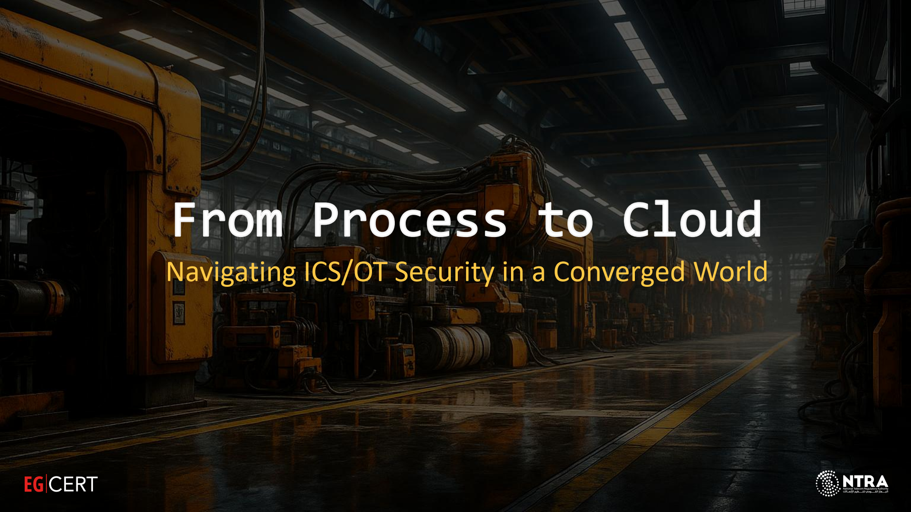
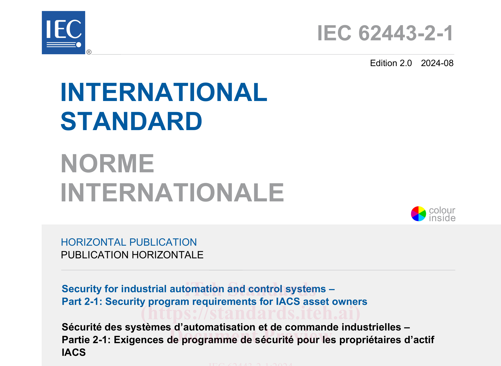
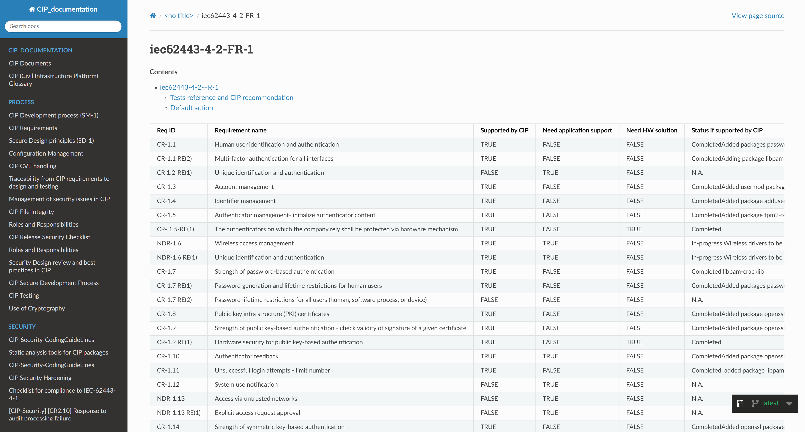
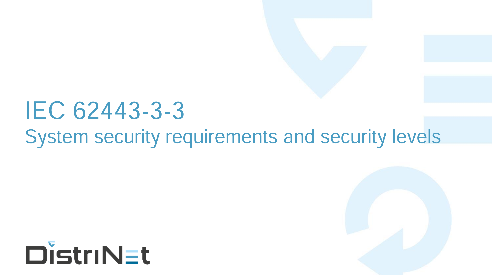
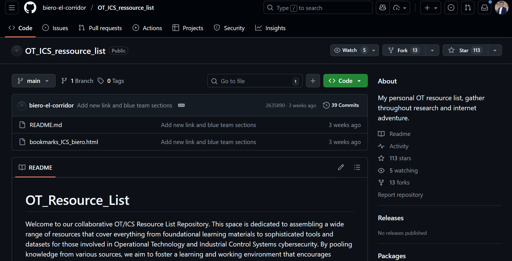
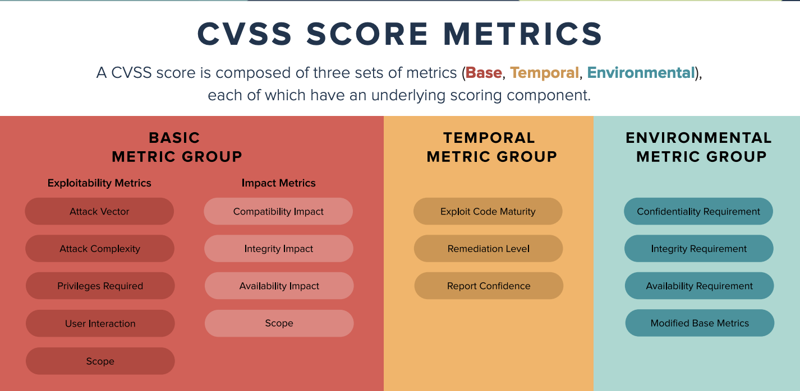
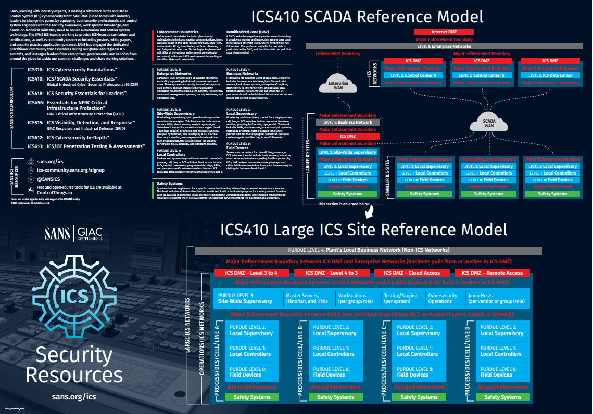
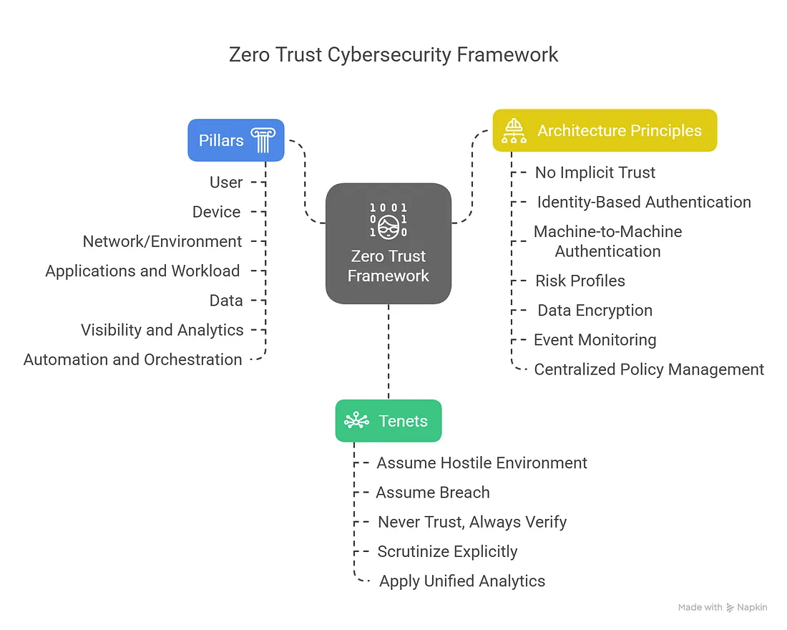
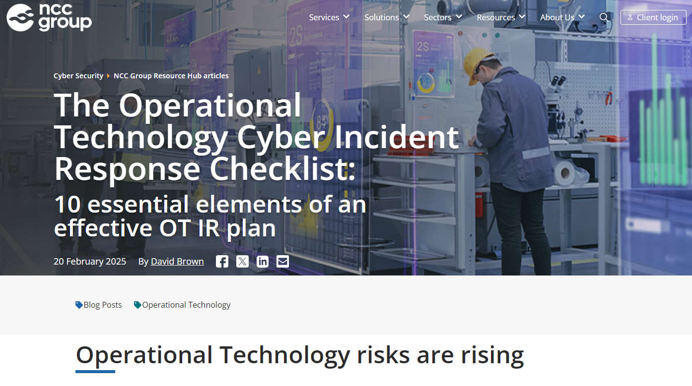
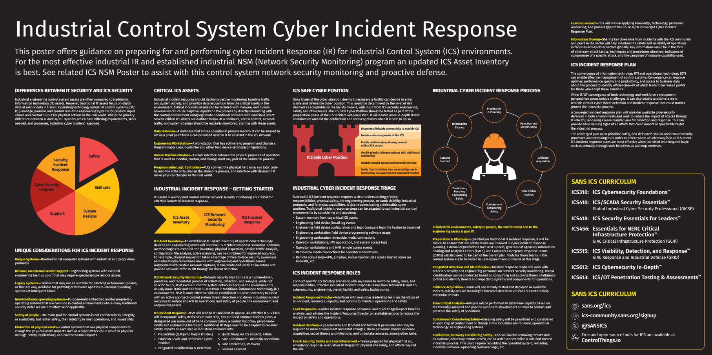

---
hide:
  - toc
  - navigation
---

# References

- [   Slides](ICS_Security2.pdf)

???+ note "IEC62443"

    

    - [   Foundational Requirements IEC62443 - Emerson](https://www.spe-aberdeen.org/wp-content/uploads/2019/11/0930_3_Foundational-Reqmts-IEC62443-Emerson.pdf)
    - <iframe width="100%" height="300" src="https://www.youtube.com/embed/UNTmKT36cXQ" title="The IEC 62443 Standards Plainly Explained" frameborder="0" allow="accelerometer; autoplay; clipboard-write; encrypted-media; gyroscope; picture-in-picture; web-share" referrerpolicy="strict-origin-when-cross-origin" allowfullscreen></iframe>
    - [   IEC 62443 Family of Standards - Bureau Veritas](https://certification.bureauveritas.com/sites/g/files/zypfnx231/files/2023-10/IEC%2062443%20family%20of%20standards%20v2.png)
    - [  IEC 62443-2-1:2024 Sample](https://cdn.standards.iteh.ai/samples/102021/ead9074305be4142a9125ad52d59f546/IEC-62443-2-1-2024.pdf)
    - [   PLCnext Community - IEC 62443-4-2 Compliance List](https://www.plcnext-community.net/security/iec_62443-4-2_compliance_list/)
    - [   IEC 62443-4-2 Organization](https://62443-4-2.org/)
    - [   CIP Documentation - IEC 62443-4-2 FR-1](https://cip-documentation.readthedocs.io/en/latest/security/iec62443-4-2-FR-1.html)
    - [   Dragos - ISA/IEC 62443 Concepts](https://www.dragos.com/blog/isa-iec-62443-concepts)
    - [   ISO/IEC JTC1 SC 27 - IEC 62443-1-1 Overview](https://www.mn.uio.no/ifi/english/people/aca/josang/docs/iso-iec-jtc1-sc-27-wg1_n3891_iso-iec-jtc1-sc27-n23913-cfc-on-iec-62443-1-1-overview-and-guidance-for-the-iec-62443-series.pdf)
    - [   IEC 62443-3-3 User Guide](https://msec.be/coassurance/UG3.2.IEC%2062443-3-3.pdf)
    - [   Industrial Security in SCADA Systems - Novotek](https://www.novotek.com/co-uk/wp-content/uploads/sites/7/2021/Resources&Downloads/Brochures/Industrial-Security-in-SCADA-Systems2202.pdf)
    - [   Fortinet IEC 62443 Reference Guide](https://www.fortinet.com/content/dam/fortinet/assets/document-library/rg-ftnt-iec-62443.pdf)
    - [   IEC 62443 Playlist - YouTube](https://www.youtube.com/playlist?list=PLOSJSv0hbPZAlINIh1HcB0L8AZcSPc80g)
    - [   IEC 62443-4-2:2019 (PDF)](https://cdn.standards.iteh.ai/samples/21919/fe56b59fa6f04b849d88a2311aa5ec15/IEC-62443-4-2-2019.pdf)
    - [   Introduction to ICS Security - Part 2 — SANS Institute](https://www.sans.org/blog/introduction-to-ics-security-part-2)
    

???+ note "IEC62443 documents"

    

    - [IEC 62443-2-1   ](./IEC 62443-2-1-2010.pdf)
    - [IEC 62443-4-2   ](./IEC 62443-4-2-2019.pdf)
    - [IEC TR 62443-2-3   ](./IEC TR 62443-2-3-2015.pdf)
    - [IEC TS 62443-1-1   ](./IEC TS 62443-1-1-2009.pdf)
    
    

???+ note "IEC62443 documents"

    

    - [Guide to Operational Technology (OT) Security   ](NIST.SP.800-82r3.pdf)
    
    

???+ note "Incedents"

    

    
    - <iframe width="100%" height="300" src="https://www.youtube.com/embed/6h2kiXMnjfY?list=PLE_wV_6kC0xtYbq8eoktg2POgH7Gby-7L" title="OT Security IG Fall &#39;25 | OT Networking Protocols and Security" frameborder="0" allow="accelerometer; autoplay; clipboard-write; encrypted-media; gyroscope; picture-in-picture; web-share" referrerpolicy="strict-origin-when-cross-origin" allowfullscreen></iframe>
    - <iframe width="100%" height="300" src="https://www.youtube.com/embed/JHPo2-ukSGg" title="OT Security IG Fall &#39;25 | FrostyGoop Malware Deep-Dive" frameborder="0" allow="accelerometer; autoplay; clipboard-write; encrypted-media; gyroscope; picture-in-picture; web-share" referrerpolicy="strict-origin-when-cross-origin" allowfullscreen></iframe>
    
    

???+ note "important"

    

    - [ICS Security Tools — ITI (GitHub)](https://github.com/ITI/ICS-Security-Tools/tree/master)
    - [Biero Llagas — Medium](https://medium.com/@biero-llagas)
    - [  OT/ICS Resource List — Biero El Corridor (GitHub)](https://github.com/biero-el-corridor/OT_ICS_ressource_list)
    - [ Temporal CVSS Scores — Balbix   ](https://www.balbix.com/insights/temporal-cvss-scores/)
    - [   SANS ICSPS - ICS410 (May 2025)](SANS-ICSPS-ICS410-0525.pdf)
    - [   What is Zero Trust — Tenets, Pillars, and Reference Architecture Principles — Tahir Balarabe (Medium)](https://medium.com/@tahirbalarabe2/what-is-zero-trust-tenets-pillars-and-reference-architecture-principles-df83343f02bd)
    - [   Operational Technology Cyber Incident Response Checklist — NCC Group](https://www.nccgroup.com/the-operational-technology-cyber-incident-response-checklist/)
    
    - [   SANS ICSPS - ICSCIR (May 2025)](docs/03-ArabFertilizerAssociation/References/SANS-ICSPS-ICSCIR-0525.pdf)
    

